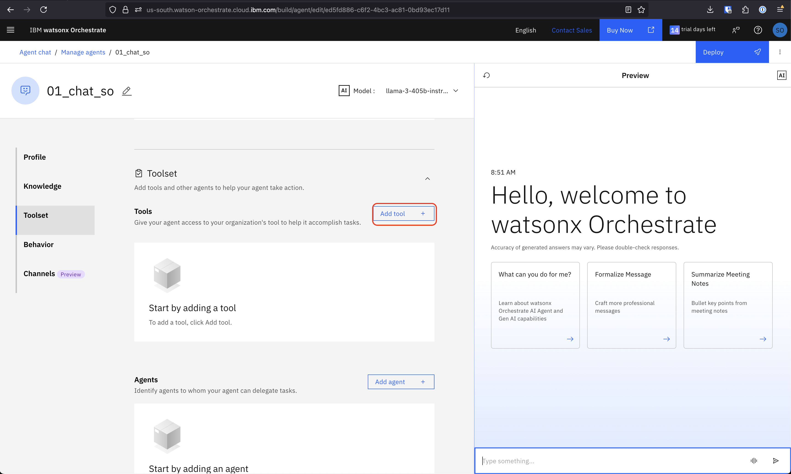
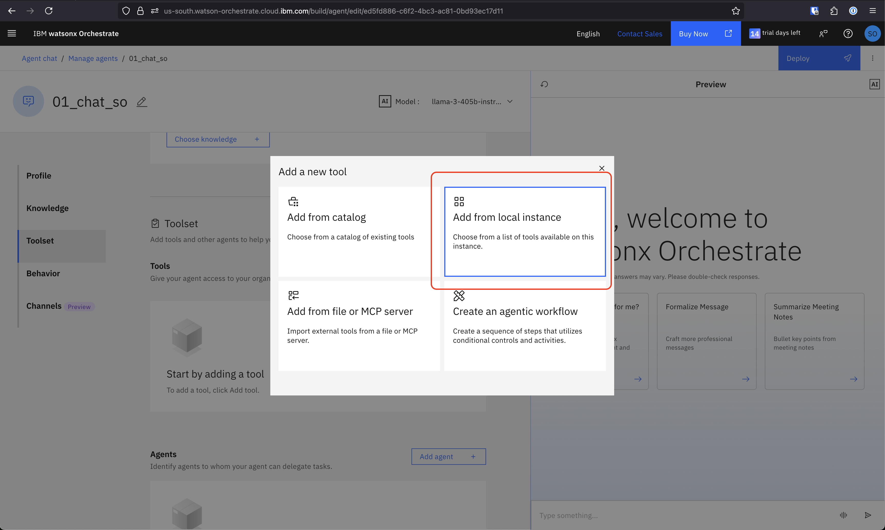
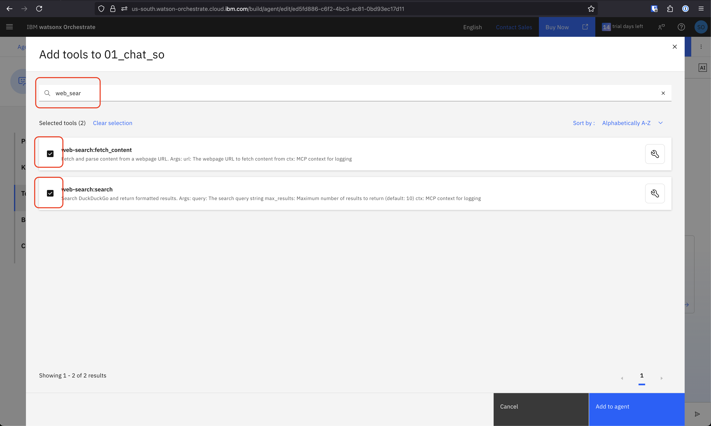
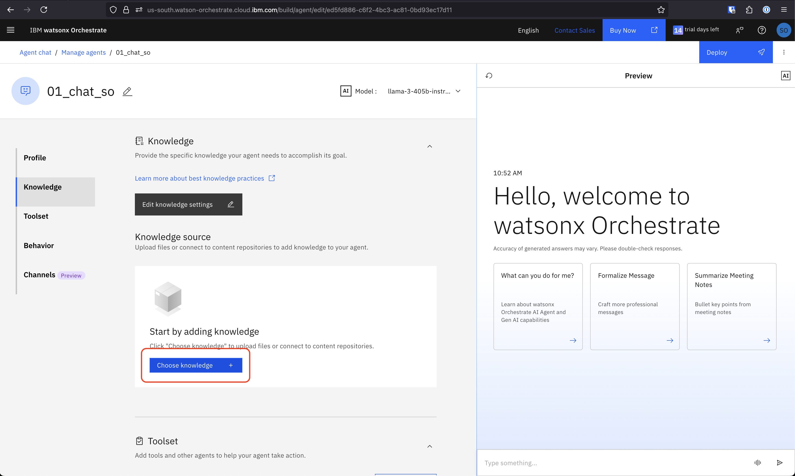
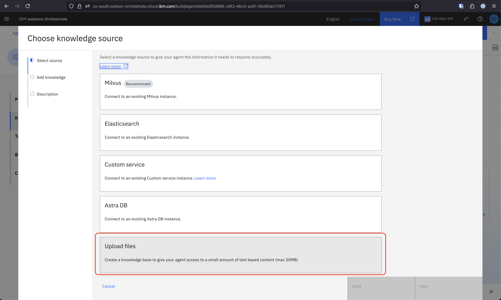
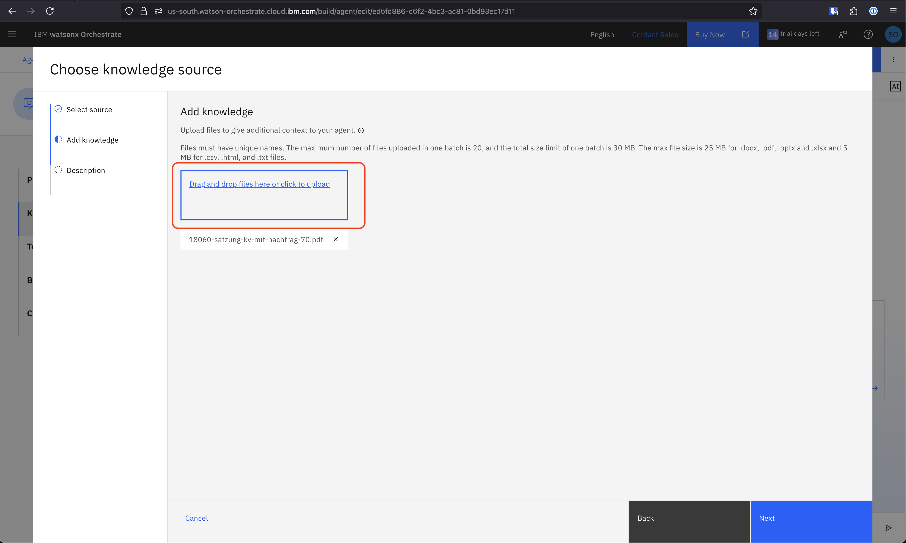
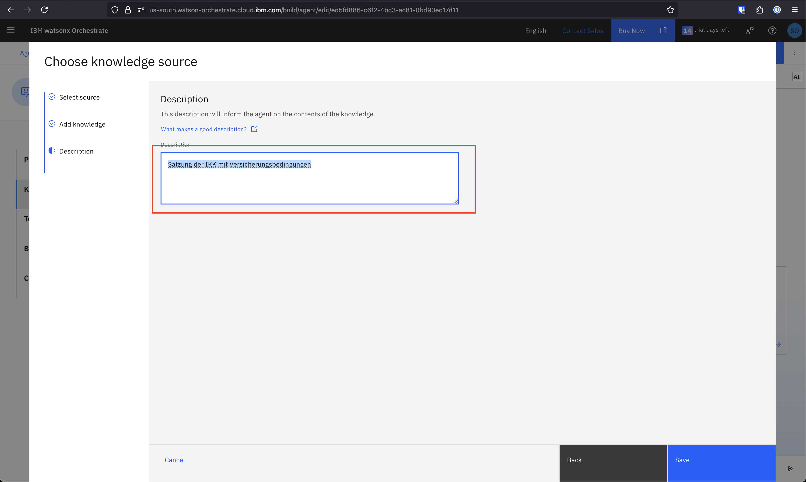
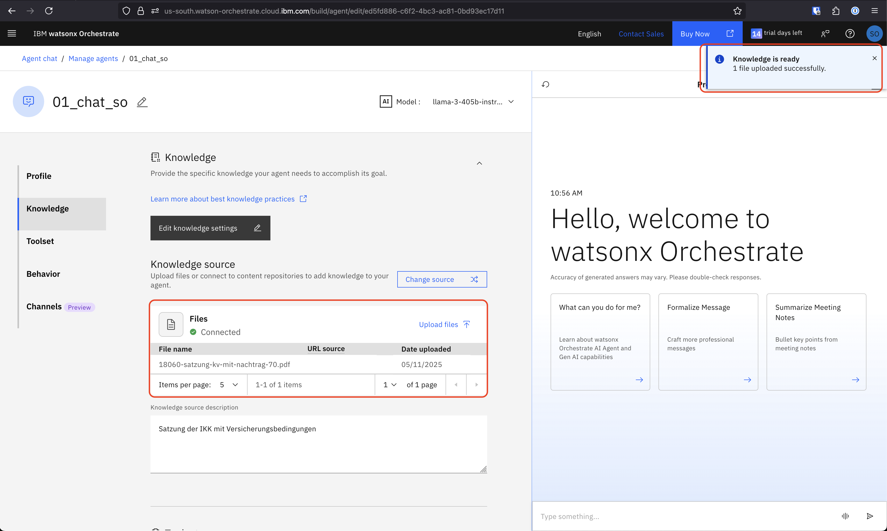

# wxo-bootcamp

## Content Overview

- [Prerequisites](#prerequisites)
  - [Get Access to watsonx Orchestrate](#get-access-to-watsonx-orchestrate)
- [Bootcamp](#bootcamp)
  - [Just Chat](#just-chat)
  - [Statischer Kontext](#statischer-kontext)
  - [Dynamischer Kontext / Tool Call](#dynamischer-kontext--tool-call)
  - [Dynamischer Kontext / RAG](#dynamischer-kontext--rag)
  - [Agent Flow / Mail Classification](#agent-flow--mail-classification)
  - [Multi-Agent](#multi-agent)
- [TODO](#todo)

## Prerequisites

### Get Access to watsonx Orchestrate

    - Create IBMId:
    https://www.ibm.com/account/reg/us-en/signup?formid=urx-19776
    - Get invited to Techzone via Techzone
    - Click "HERE" to join Cloud Account from Mail
    - Create Cloud Account
    - Signout
    - Go to new mail, "Join IBM Cloud Account"
    - Login to watsonx Orchestrate

## Bootcamp

### Just Chat

#### Erstelle einen Agenten, der einfach nur Fragen beantwortet.

1. Gehe zu "Agent Builder" (oben links Hamburgermenü)
   
   

2. Klicke "Create agent"

- Nenne deinen Agenten "01_Chat\_[Deine Initialien]"


3. Gib deinem Agenten eine Beschreibung, z.B.: `An Agent for talking about our Agentic AI Bootcamp`


4. Wähle ein Model aus ("llama-3-405b-instruct")


5. Chatte mit dem Agenten

### Statischer Kontext

1. Gib deinem Agenten Verhaltensanweisungen im "Behaviour" Feld, z.B.: `
Bitte sei freundlich und antworte mit vielen Emojis.`


2. Teste deinen Agenten

3. Gib deinem Agenten statischen Kontext im "Behaviour" Feld, z.B.:

```
Du weißt folgende Dinge:
- Wir machen heute ein Agentic AI Bootcamp mit der IKK, Valentic und der IBM
- Stephans T-Shirt ist rot
- Die Nutzer sind in Hamburg
- Deine Rechenresourcen sind in Dallas in der USA.
- Heute ist der 6.11.2030
```


4. Teste deinen Agenten.

- "Von welcher Firma bin ich?"
- "Welcher Tag ist heute?"

Was fällt auf?

### Dynamischer Kontext / Tool Call

#### Erstellen einen Agenten, der auf das Internet zugreifen kann und Fragen zu aktuellen Themen beantworten kann.

1. Schließe den vorherigen Agenten
2. Klicke "Create agent"
3. Nenne deinen Agenten "02_ToolCall\_[Deine Initialien]"
4. Gib deinem Agenten eine Beschreibung, z.B.:

```
An Agent that can search the web and answer questions on anything that we can find on the web.
```

5. Wähle ein Model aus ("llama-3-405b-instruct")
6. Klicke "Add Tool"
   

7. Klicke "Add from local instance"
   

8. Suche nach "web-search" und füge die beiden tools hinzu
   

9. Frage deinen Agenten etwas, z.B.

```
Was sind neueste Nachrichten über Trump?
```

- Experimentiere mit dem "Behaviour" Feld, wie kannst du den Output beeinflussen?

### Dynamischer Kontext / RAG

Erstelle einen Agenten, der Fragen aus Kontext aus eines PDF beantwortet.

1. Klicke "Create agent"
2. Nenne deinen Agenten "03_RAG\_[Deine Initialien]"
3. Gib deinem Agenten eine Beschreibung, z.B.:

```
An Expert Agent that has access to knowledge all around the IKK.
```

4. Lade das PDF mit der IKK Satzung herunter. Entweder von [hier](./pdfs/18060-satzung-kv-mit-nachtrag-70.pdf) oder von der Webseite der IKK.

5. Klicke auf "Choose Knowledge"
   

6. Klicke auf "Upload files"
   

7. Füge das PDF hinzu
   

8. Füge Beschreibung hinzu, z.B. `Satzung der IKK mit Versicherungsbedingungen`
   

9. Warte bis die Wissensbasis verfügbar ist
   

10. Frage deinen Agenten etwas was in der IKK Satzung steht, z.B.

```
Wann kann ein Mitglied seinen Tarif kündigen?
```

Was fällt auf bezüglich Qualität?

#### Exkurs low-code ADK!

Achtung! Für den import-Schritt muss in cloud.ibm.com > Access IAM > Api Keys ein neuer Key angelegt und für das remote genutzt werden.

```
orchestrate env add -n remote -u https://api.us-south.watson-orchestrate.cloud.ibm.com/instances/92119551-3f4c-44ff-978c-a639cc3f50f4

orchestrate env activate remote
# enter api key

orchestrate knowledge-bases list
# korrekte aussuchen

orchestrate knowledge-bases export -n knowledge_for_agent_agent_01_Chat_80958z -o kb.yaml

# ersetzen von embedding model ibm/slate-125m-english-rtrvr-v2 mit ibm/multilingual-e5-large

orchestrate knowledge-bases import -f kb.yaml
```

Hat sich die Qualität verändert?

### Agent Flow / Mail Classification

Erstelle einen Agenten, der einen Agent Flow benutzt um Emails zu bearbeiten

- Klicke "Create agent"
- Nenne deinen Agenten "04_MAIL\_[Deine Initialien]"
- Gib deinem Agenten eine Beschreibung, z.B.:

```
An agent that can draft responses to incoming insurance related emails.
```

- Klicke "Add Tool" -> "Create an agentic workflow"
- Konfigurire deinen Workflow
  - oben links "Edit details"
  - Namen ändern mit Initialien (z.B. mail_expert_flow\_[Deine Initialien])
  - Beschreibung hinzufügen

```
This flow drafts a response email to an insurance related mail from a customer to an insurance company.
```

- Füge eine Input variable: **mail** vom typ string hinzu und gib ihr eine Beschreibung, z.B.:

```
The customers mail that should be answered.
```

- Füge eine Output variable: **mail_response_draft** vom typ string hinzu und gib ihr eine Beschreibung, z.B.:

```
The draft of the response mail to the customer
```

- Klicke "Save"
- Klicke auf den Pfad zwischen "inputs" und "outputs"
- Füge einen "Generative Prompt" hinzu
- Nenne ihn "Master Agent"

> Diese Node wird unser "Klassifizierer", der entscheiden soll, welcher Experte zu der Mail befragt werden soll

- Gehe zu "Prompt Settings"
- Füge eine input variable hinzu (mail)
- Wähle ein starkes Model, z.B. (llama-4-maverick-17b-128e-instruct)
- Gehe zu "Adjust LLM Settings" und stelle das Token-window auf max: 2000
- Befülle das System Prompt Feld mit dem text aus [master.txt](/experts/master.txt)
- Wähle "Output als Objekt"
- Nenne es "output"
- Definiere das Schema:

```
{
    "expert": {
        "type": "string"
    }
}
```

- Setze einen Wert für den "test value" von dem mail input, z.B. den Text aus [mail-1](/example-mails/mail_1_kostenuebernahme.txt)
- Teste deinen Agenten mit "Generate Preview"
- Als output solltest du sowas sehen:

```
{
  "expert": "kostenuebernahme"
}
```

- Schließe den "Master Agenten"
- Klicke nochmal auf den "Master Agenten" und wähle "Edit Data Mapping"
- Anstelle von "Auto-map" wollen wir die Flow-Input Variable "mail" auswählen
  - Klicke auf "Variable" -> Input -> mail
  - Schließe das Input Mapping
- Klicke auf den Pfad zwischen "output" und "Master Agent"
  - Füge einen "Branch" hinzu
  - Lösche vorerst "Path 1", wir arbeiten erstmal nur mit dem "default" Branch
- Über "add" füge einen weiteren "Generative Prompt" hinzu
  - Nenne ihn "Sonstiges Agent"
  - Setze auch den mail Input parameter, model und LLM Settings
  - Setze den System Prompt aus [sonstiges](/experts/sonstiges.txt)
  - Konfigurire die Datamappings zu Input -> Mail
- Füge einen weiteren "Generative Prompt" nach dem "Sonstiges Agenten" hinzu
- Nenne ihn "Mail Writer"
  - Setze 2 Input parameter: mail & analysis
  - Setze das System Prompt [mail](/experts/mail_answer.txt)
  - Datamapping:
    - Mail sollte die mail aus dem Input sein
    - Analysis sollte der "value" vom "Sonstiges Agenten" sein
- Konfiguriere das Datamapping vom Output
  - setze mail_response_draft auf den "value" vom Mail Writer
- Clicke **DONE** oben rechts im Flow

- Teste deinen Agenten mit einer Beispiel Mail, z.B.:

```
Kannst du mir eine Antwort für folgende Mail schreiben:

...
```

- Füge weitere Experten hinzu.
- Klicke auf den "Branch" -> klicke "Add path"
- Die Pfade können bennant werden, benenne sie mit "sonstiges" (für den default path) und "kostenuebernahme" (für den anderen)
- Klicke "Edit condition" bei "kostenuebernahme"
- bei "if", klicke "+", wähle den Master Agenten, und dort "output.expert" und dann "==", "kostenuebernahme"

so sollte es aussehen:


- Verknüpfe einen weiteren "Generative Prompt" mit dem Path und mache daraus den "Kostenuebernahme Experten", analog zu dem "Sonstiges Agenten"
- Verknüpfe den Agenten mit dem "Mail Writer"
- Passe das Data Mapping des "Mail Writers" an
  - bei analysis klicke auf "Expression" und schreibe:

```python
flow["Sonstiges Agent"].output.value or flow["Kostenuebernahme Agent"].output.value
```

- Teste deinen Agenten

- Freies Optimieren:
  - Füge weitere Experten hinzu
  - Verändere die LLM Settings
  - Verändere die Prompts
  - Verändere das Behaviour

### BONUS: Multi-Agent

Erstelle einen Agenten, der mehrere Expertenagenten nutzt um eine Frage zu beantworten.
