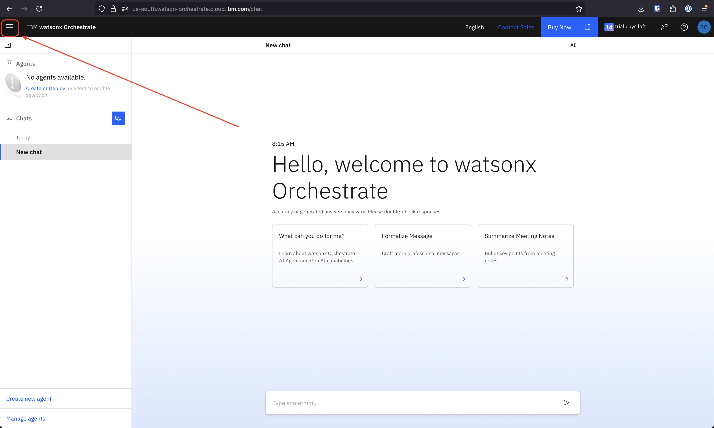
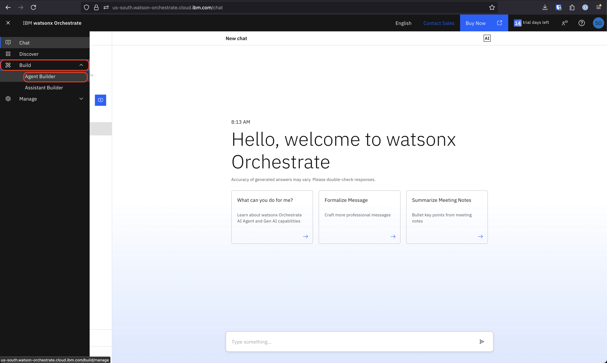
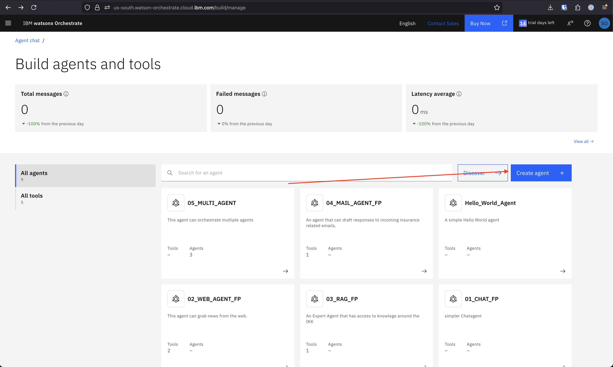
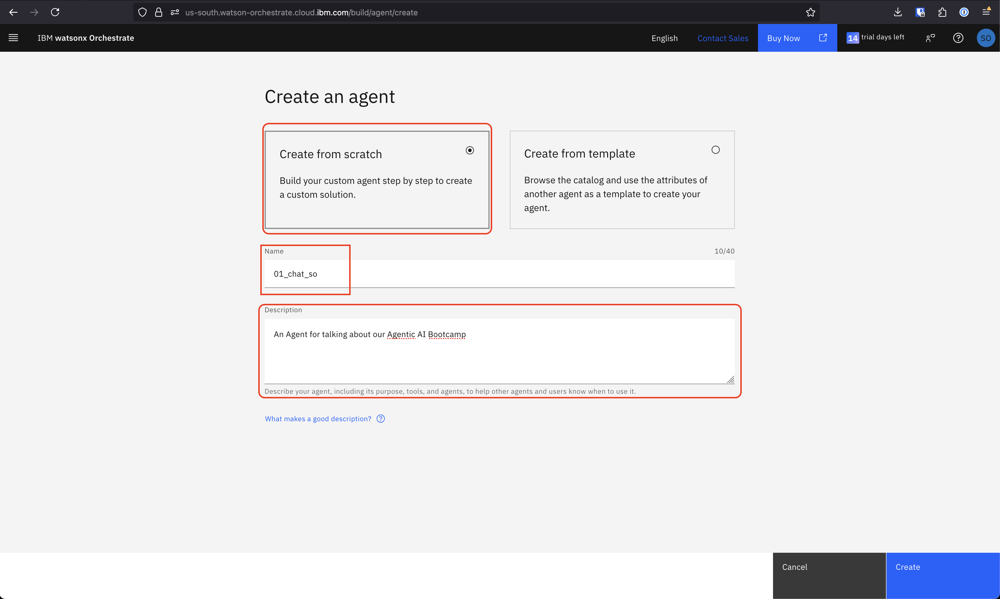
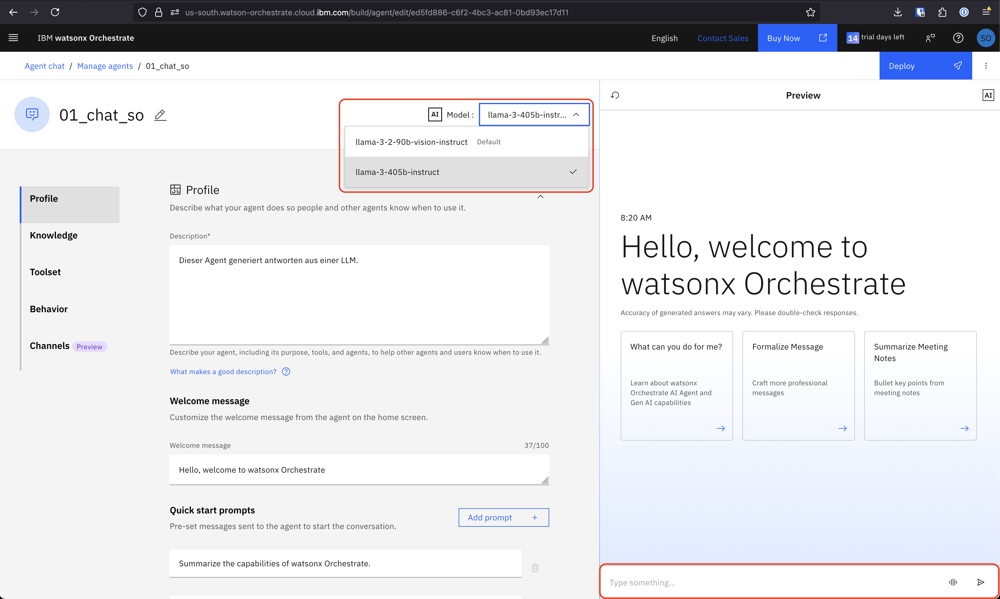
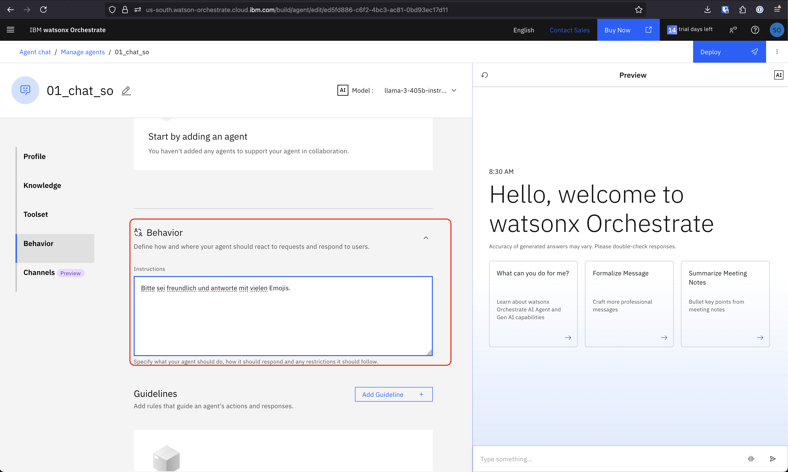
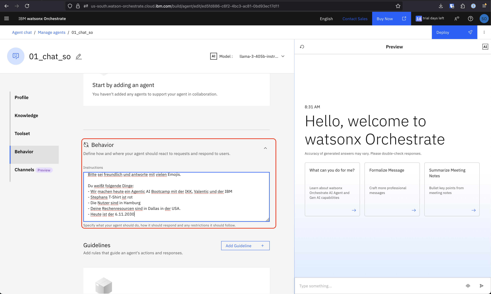

# wxo-bootcamp

## Content Overview

- [Prerequisites](#prerequisites)
  - [Get Access to watsonx Orchestrate](#get-access-to-watsonx-orchestrate)
- [Bootcamp](#bootcamp)
  - [Just Chat](#just-chat)
  - [Statischer Kontext](#statischer-kontext)
  - [Dynamischer Kontext / Tool Call](#dynamischer-kontext--tool-call)
  - [Dynamischer Kontext / RAG](#dynamischer-kontext--rag)
  - [Agent Flow / Mail Classification](#agent-flow--mail-classification)
  - [Multi-Agent](#multi-agent)
- [TODO](#todo)

## Prerequisites

### Get Access to watsonx Orchestrate

    - Create IBMId:
    https://www.ibm.com/account/reg/us-en/signup?formid=urx-19776
    - Get invited to Techzone via Techzone
    - Click "HERE" to join Cloud Account from Mail
    - Create Cloud Account
    - Signout
    - Go to new mail, "Join IBM Cloud Account"
    - Login to watsonx Orchestrate

## Bootcamp

### Just Chat

#### Erstelle einen Agenten, der einfach nur Fragen beantwortet.

1. Gehe zu "Agent Builder" (oben links Hamburgermenü)
   
   

2. Klicke "Create agent"

- Nenne deinen Agenten "01_Chat\_[Deine Initialien]"



3. Gib deinem Agenten eine Beschreibung, z.B.: `An Agent for talking about our Agentic AI Bootcamp`



4. Wähle ein Model aus ("llama-3-405b-instruct")



5. Chatte mit dem Agenten

### Statischer Kontext

1. Gib deinem Agenten Verhaltensanweisungen im "Behaviour" Feld, z.B.: `
Bitte sei freundlich und antworte mit vielen Emojis.`



2. Teste deinen Agenten

3. Gib deinem Agenten statischen Kontext im "Behaviour" Feld, z.B.:

```
Du weißt folgende Dinge:
- Wir machen heute ein Agentic AI Bootcamp mit der IKK, Valentic und der IBM
- Stephans T-Shirt ist rot
- Die Nutzer sind in Hamburg
- Deine Rechenresourcen sind in Dallas in der USA.
- Heute ist der 6.11.2030
```



4. Teste deinen Agenten.

- "Von welcher Firma bin ich?"
- "Welcher Tag ist heute?"

Was fällt auf?

### Dynamischer Kontext / Tool Call

#### Erstellen einen Agenten, der auf das Internet zugreifen kann und Fragen zu aktuellen Themen beantworten kann.

- Schließe den vorherigen Agenten
- Klicke "Create agent"
- Gib deinem Agenten eine Beschreibung, z.B.:

```
An Agent that can search the web and answer questions on anything that we can find on the web.
```

- Wähle ein Model aus ("llama-3-405b-instruct")
- Klicke "Add Tool"
- Klicke "Add from local instance"
- Suche nach "web-search" und füge die beiden tools hinzu
- Frage deinen Agenten etwas, z.B.

```
Was sind neueste Nachrichten über Trump?
```

- Experimentiere mit dem "Behaviour" Feld, wie kannst du den Output beeinflussen?

### Dynamischer Kontext / RAG

Erstelle einen Agenten, der Fragen aus Kontext aus einer Textdatei beantwortet.

- Klicke "Create agent"
- Nenne deinen Agenten "03_RAG\_[Deine Initialien]"
- Gib deinem Agenten eine Beschreibung, z.B.:

```
An Expert Agent that has access to knowledge all around the IKK.
```

- Füge das Tool "ikk-knowledge" hinzu
- Frage deinen Agenten etwas was in der IKK Satzung steht, z.B.

```
Wann kann ein Mitglied seinen Tarif kündigen?
```

### Agent Flow / Mail Classification

Erstelle einen Agenten, der einen Agent Flow benutzt um Emails zu bearbeiten

- Klicke "Create agent"
- Nenne deinen Agenten "04_MAIL\_[Deine Initialien]"
- Gib deinem Agenten eine Beschreibung, z.B.:

```
An agent that can draft responses to incoming insurance related emails.
```

- Klicke "Add Tool" -> "Create an agentic workflow"
- Konfigurire deinen Workflow
  - oben links "Edit details"
  - Namen ändern (z.B. Mail Expert Flow)
  - Beschreibung hinzufügen

```
This flow drafts a response email to an insurance related mail from a customer to an insurance company.
```

- Füge eine Input variable: **mail** vom typ string hinzu und gib ihr eine Beschreibung, z.B.:

```
The customers mail that should be answered.
```

- Füge eine Output variable: **mail_response_draft** vom typ string hinzu und gib ihr eine Beschreibung, z.B.:

```
The draft of the response mail to the customer
```

- Klicke "Save"
- Klicke auf den Pfad zwischen "inputs" und "outputs"

- Was wenn es nicht klappt? :
  - Output fenster des Prompts nicht groß genug?

### Multi-Agent

Erstelle einen Agenten, der mehrere Expertenagenten nutzt um eine Frage zu beantworten.

## TODO

- RAG auf knowledge umstellen
- Agentflow bschreiben
- login über ibm cloud dokumentieren
